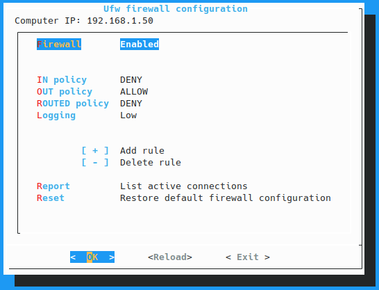

# Tufw
Ufw terminal frontend based on dialog



# 
## Installation
Tufw **NEEDS** to be installed as root, because it needs to run as root and python won't load the module if it's installed as a normal user.
```sh
sudo python3 -m pip install tufw
# OR
sudo pip3 install tufw
```
Obviously Tufw needs [`dialog`](https://invisible-island.net/dialog/), so install it with
```sh
sudo apt install dialog
```
or what you use on your distribution.
# 
## Running
As ufw, Tufw needs to be run as root.
```sh
sudo tufw
```
I know typing '`sudo `' (space included) is always tiring and easy to forget and ufw refuses to work without, so Tufw can self elevate, calling sudo itself if you forget to.

You can just type:
```sh
tufw
```
# 
## Give to Caesar what is Caesar's
This project comes from my need to have a simple frontend for ufw like [@costales](https://github.com/costales)' [gufw](https://github.com/costales/gufw), but character based, to install on my headless server, so the code in `firewall.py` comes from costales' work, simplified a bit, but still his work.
